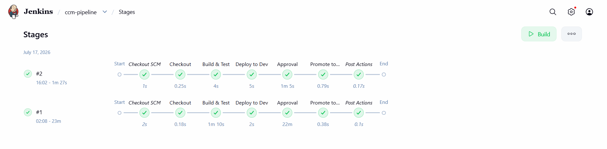
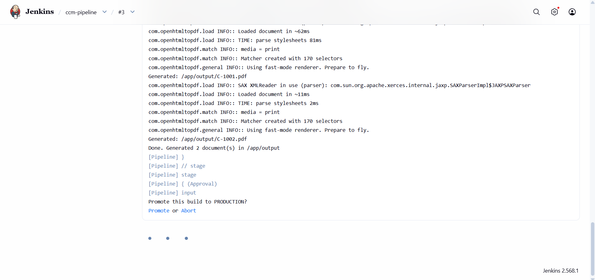

# CCM Pipeline Demo

A miniature **Customer Communications Management (CCM)** system with a full **CI/CD pipeline**. A small Java application merges customer data into templates to generate personalized PDF documents (invoices), and a Jenkins pipeline builds, tests, containerizes, and promotes it through environments with a manual approval gate before production.

## What this demonstrates

This project models the **design → build → validate → promote** workflow used by enterprise customer-communications platforms: personalized documents generated from data and templates, version-controlled, and promoted across environments through an automated, auditable pipeline. The same pipeline is implemented in **both Jenkins and GitLab CI** to show the workflow translates across tools.

## Architecture

```
customers.json  ─┐
                 ├─▶  DocumentGenerator  ─▶  Thymeleaf template  ─▶  openhtmltopdf  ─▶  personalized PDFs
invoice.html   ─┘        (Java)               (HTML merge)            (HTML → PDF)
```

The generator (`com.rain`) reads customer records from JSON, merges each into an HTML template with Thymeleaf, and renders the result to a PDF with openhtmltopdf. It is packaged as a self-contained "fat jar" and shipped as a Docker image.

Around this sits the CI/CD pipeline:

```
Checkout ─▶ Build & Test ─▶ Deploy to Dev ─▶ [Manual Approval] ─▶ Promote to Prod
```

## Pipeline (Jenkins)



Each stage, and why it exists:

- **Checkout** — pulls the source from SCM.
- **Build & Test** — runs `docker build`, which uses a **multi-stage Dockerfile**: the first stage compiles the code and runs the JUnit tests with Maven; the second copies only the resulting jar into a slim JRE image. A failing test fails the image build, which stops the pipeline here.
- **Deploy to Dev** — tags the built image as `dev` and runs it, generating the documents.
- **Manual Approval** — the pipeline pauses and waits for a human to approve promotion. This models the controlled, auditable release step used in compliance-sensitive environments.



- **Promote to Prod** — on approval, re-tags the exact same image as `prod`. Promotion is done by re-tagging, not rebuilding, so the artifact that was tested is the artifact that ships.

The Jenkins instance itself runs in Docker, with the host Docker socket mounted so pipeline stages can build and run images.

## Pipeline (GitLab CI)

`.gitlab-ci.yml` mirrors the Jenkins pipeline stage-for-stage, using GitLab's Docker-in-Docker service in place of the mounted Docker socket, and a `when: manual` job in place of the Jenkins `input` approval gate. The pipeline concepts port directly between the two tools.

## Tech stack

- **Java 17**, **Maven**
- **Thymeleaf** (HTML templating)
- **openhtmltopdf** (HTML → PDF)
- **Jackson** (JSON binding)
- **JUnit 5** (tests, including a check that generated PDFs are non-empty)
- **Docker** (multi-stage build)
- **Jenkins** and **GitLab CI** (CI/CD)

## Run it locally

Generate documents directly:

```bash
mvn clean package
java -jar target/ccm-generator.jar
# PDFs are written to ./output
```

Or run it in a container, writing the PDFs back to the host:

```bash
docker build -t ccm-generator .
docker run --rm -v "${PWD}/output:/app/output" ccm-generator
```

## Notes

- The production image is deliberately minimal (JRE only), so PDF text renders using a fallback font — a realistic tradeoff when keeping container images small.
- The pipeline concepts (build → test → promote across environments, with a manual gate) are the transferable part; the specific tooling is interchangeable.